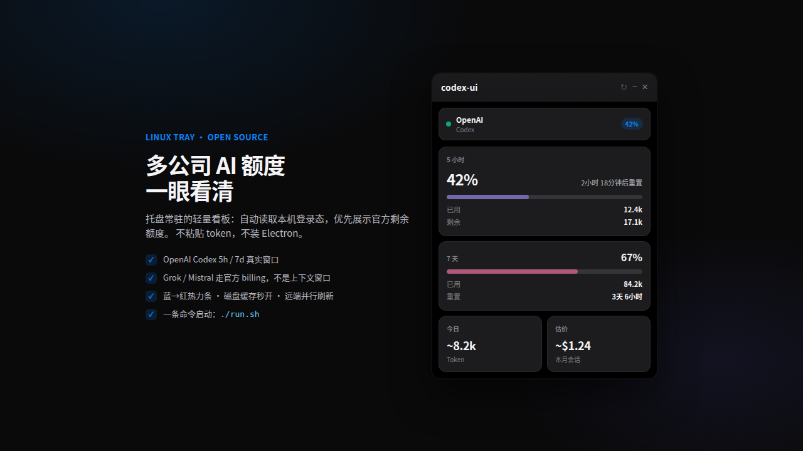
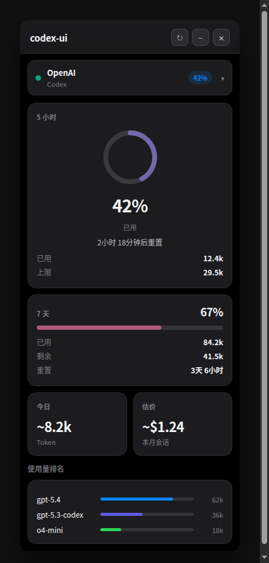
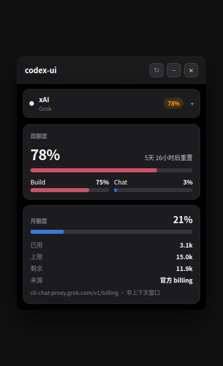
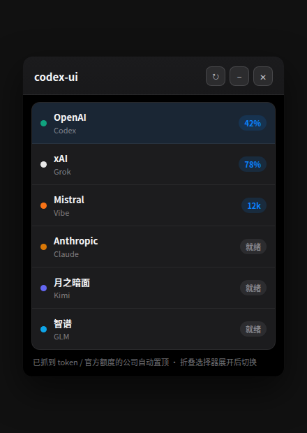

# codex-ui

<p align="center">
  
</p>

<p align="center">
  <strong>Lightweight Linux tray dashboard for multi-company AI usage</strong><br/>
  OpenAI Codex · Claude · Grok · Mistral · Kimi · GLM
</p>

<p align="center">
  <a href="./README.zh.md">中文说明</a>
  ·
  <a href="#quick-start">Quick start</a>
  ·
  <a href="#features">Features</a>
</p>

---

Codex has desktop apps on Windows and macOS. On Linux, the usual workflow is still the CLI — and answering *“how much quota is left?”* means digging through terminals or web consoles.

**codex-ui** is a small tray app that stays out of the way until you need it. One script, your existing logins, real remaining quota when the provider exposes it — no token pasting, no heavy Electron runtime.

Built with **Neutralino + React + TypeScript**.

## Screenshots

Real product UI (dark Apple-style panel used by the app):

<p align="center">
  
  &nbsp;
  
  &nbsp;
  
</p>

| | |
|---|---|
| **OpenAI** | 5h ring + 7d bar, local token burn, model ranking |
| **Grok** | Official weekly credits + monthly units (`cli-chat-proxy` billing — not context window) |
| **Companies** | Foldable picker; providers with usage pin to the top |

## Features

| Area | What you get |
|------|----------------|
| **Multi-company strip** | OpenAI, Anthropic, xAI Grok, Mistral, Kimi, GLM — foldable picker; companies with captured usage pin to the top |
| **OpenAI Codex** | Live 5h / 7d windows via Codex app-server or WHAM, reset credits, model spend estimate |
| **Grok** | Official billing: weekly credits + Build/Chat split + monthly credit units |
| **Mistral Vibe** | Monthly token view + rate-limit headers when available; free tier shows local calendar-month burn when no month cap |
| **Heat meters** | Continuous **blue → red** progress (low = blue, high = red) |
| **Fast open** | Disk **stale-while-revalidate** cache: paint last snapshot immediately, refresh in the background; remotes load in parallel |
| **Local first** | Reads `~/.codex`, `~/.grok`, `~/.vibe` session/auth files automatically |
| **Linux tray** | Autostart from settings; Zorin / Wayland keeps a taskbar entry when tray is flaky |

## Quick start

```bash
./run.sh
```

The script installs npm deps, prepares Neutralino, checks Codex auth (`codex login` if needed), builds, and starts the tray UI.

### Developer checks

```bash
npm test
npm run typecheck
npm run build
```

### Where the app lands

```text
neutralino-dist/codex-ui/
neutralino-dist/codex-ui/bin/neutralino-linux_x64
```

## How quota is loaded

```text
Open tray
  → paint disk/memory cache (instant if present)
  → phase A: local scan + last remote numbers
  → phase B: parallel official remotes
       · Codex app-server / WHAM
       · Grok  GET /v1/billing (+ ?format=credits)
       · Mistral rate-limit probe (cached ~10 min) + optional admin
```

Grok and Mistral **never** treat session context-window counters as billed API usage.

## Auth paths (read-only)

| Company | Typical local path |
|---------|-------------------|
| OpenAI Codex | `~/.codex/auth.json` |
| Grok / xAI | `~/.grok/auth.json` (OIDC) |
| Mistral Vibe | `~/.vibe/.env` (`MISTRAL_API_KEY`) |

No tokens are pasted into the UI. Network calls use temporary curl config files that are cleaned up after use.

## Zorin / Wayland

The window keeps a normal taskbar entry so you can always recover the dashboard if the tray icon is missing.

Optional tray helper:

```bash
./run.sh --setup-tray
```

## Project layout

```text
src/
  components/     # Popover UI (companies, rings, Grok/Mistral panels)
  services/       # usage parsing, local providers, Neutralino backend
  store/          # Zustand usage state
docs/images/      # README screenshots (HTML mocks → PNG)
```

## Privacy & system impact

- Quota cache is stored locally (Neutralino storage / small JSON).
- Does not install drivers or change system networking.
- Optional autostart only if you enable it in Settings.

## License / status

Personal open project. Expect rough edges; PRs and issues welcome on GitHub.

---

<p align="center">
  <sub>Made for Linux users who just want to know how much AI budget is left.</sub>
</p>
