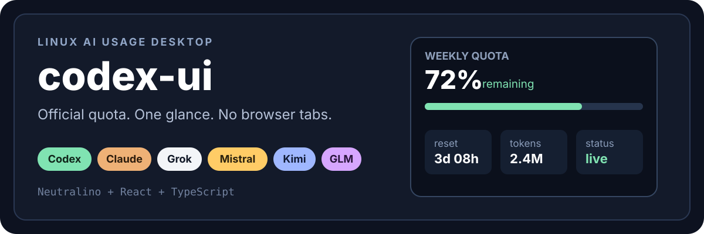
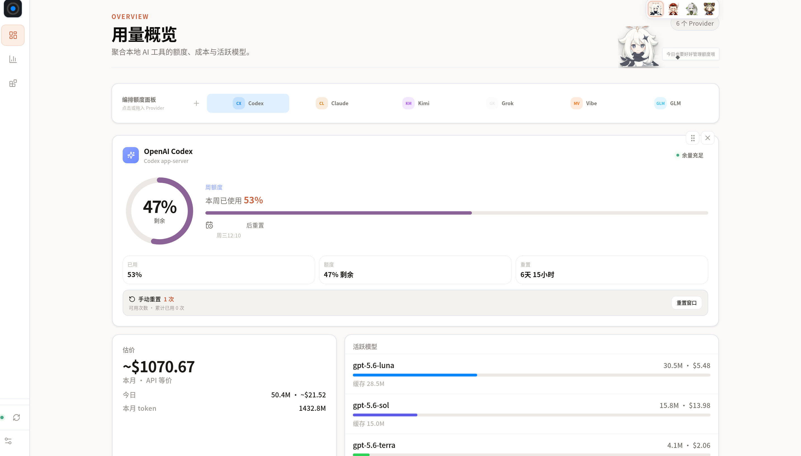
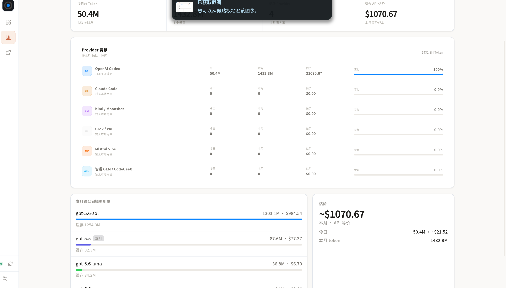
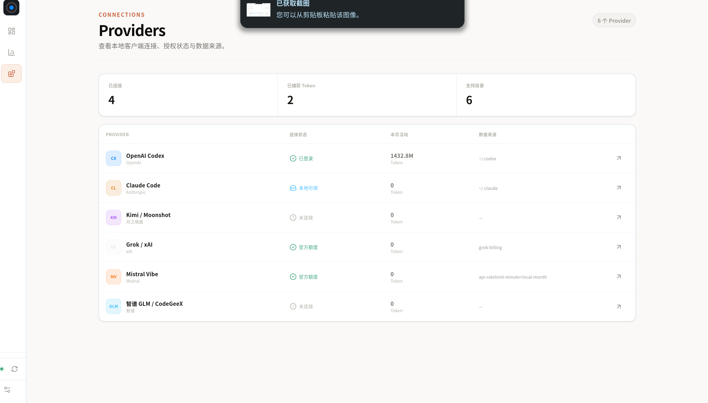

<p align="center">
  
</p>

<p align="center"><strong>See AI quota, cost, and local usage in one Linux desktop workspace.</strong></p>

<p align="center">
  <a href="./README.zh.md">中文</a> ·
  <a href="#quick-start">Quick start</a> ·
  <a href="#real-interface">Real interface</a> ·
  <a href="#privacy-and-data-sources">Privacy</a>
</p>

<p align="center">
  
</p>

## What it is

`codex-ui` is a lightweight Linux desktop workspace for AI usage. It reads local CLI sessions and available provider data, then brings quota, reset windows, tokens, cost estimates, and connection state into one view.

It supports OpenAI Codex, Claude, Kimi, Grok, Mistral Vibe, GLM, and other local providers. Built with **Neutralino + React + TypeScript**, without bundling the full Electron runtime.

## Real interface

### Overview

Compose the dashboard by clicking or dragging providers into the workspace, then inspect quota windows, reset times, cost, and active models.

<p align="center"></p>

### Usage analysis

Compare daily and monthly tokens, estimated cost, provider contribution, and cross-provider model usage.

<p align="center"></p>

### Provider connections

Review login state, local availability, monthly activity, and the source used for each provider.

<p align="center"></p>

## Features

- **Drag-and-drop quota dashboard** — add, remove, and reorder provider cards.
- **Official data first** — Codex app-server / WHAM, Grok billing, Mistral rate limits, and other official sources when available.
- **Cache-first startup** — render the last local snapshot immediately, then refresh in parallel.
- **Local-first authentication** — read CLI state from `~/.codex`, `~/.grok`, `~/.vibe`, and similar directories without pasting tokens into the UI.
- **Linux tray and taskbar** — keep the workspace one click away, with a taskbar fallback when tray integration is unreliable.
- **Selectable companion characters** — optional Q-style characters with subtle idle motion on the overview screen.

> **Unofficial fan-made decoration notice:** This project is independent from *Genshin Impact*, miHoYo, HoYoverse, and all related rights holders. It is not affiliated with, authorized by, sponsored by, or endorsed by them. The Q-style characters are included only as a personal-interest decoration for a local interface; they are not part of the codex-ui brand, product, or any commercial partnership. Character names, likenesses, and related rights remain with their respective owners.

## Quick start

Requirements: Linux, Node.js 20+, and a graphical session. Complete `codex login` first if you want Codex data.

```bash
git clone https://github.com/dell121212/codex-ui.git
cd codex-ui
./run.sh
```

The script installs dependencies, prepares Neutralino, checks local auth, builds, and launches the desktop UI.

### Development checks

```bash
npm install
npm run dev

npm test
npm run typecheck
npm run build

# Browser drag regression
npm run dev
npm run test:browser
```

### Build output

```text
neutralino-dist/codex-ui/bin/neutralino-linux_x64
```

## How data flows

```text
Open the app
  → read the local cache immediately
  → scan local CLI auth and session data
  → query available official quota endpoints in parallel
  → merge provider, model, token, and cost data
```

When a provider has no official quota endpoint, codex-ui shows local availability or missing data explicitly. It does not present a session context window as billed API usage.

## Privacy and data sources

- Quota cache stays on the local machine.
- Authentication directories are scanned read-only; tokens are not displayed in the UI.
- Network requests use temporary configuration and clean it up afterward.
- No drivers or system network rewrites. Autostart is opt-in from Settings.

Typical paths:

| Provider | Path |
| --- | --- |
| OpenAI Codex | `~/.codex/auth.json` |
| Grok / xAI | `~/.grok/auth.json` |
| Mistral Vibe | `~/.vibe/.env` |
| Claude / Kimi / GLM | respective CLI home directories when present |

## Project layout

```text
src/components/   # toolbar, quota cards, drag canvas, workspaces
src/services/     # provider parsing, local data, Neutralino backend
src/store/        # usage and board state
docs/images/      # real UI screenshots used by this README
```

## License and status

Personal open-source project. Issues and PRs are welcome. Some UI assets are recorded in the local asset provenance note at `public/assets/game-ui/README.md`. This notice expresses project intent but is not a substitute for permission and cannot guarantee that copyright, trademark, or other legal risk is eliminated in every jurisdiction. Remove unlicensed character assets or replace them with owned/licensed assets before public redistribution or commercial use.
