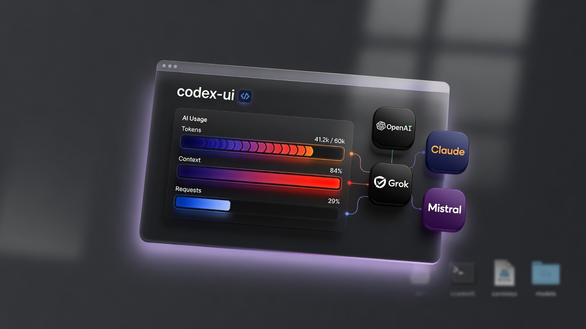
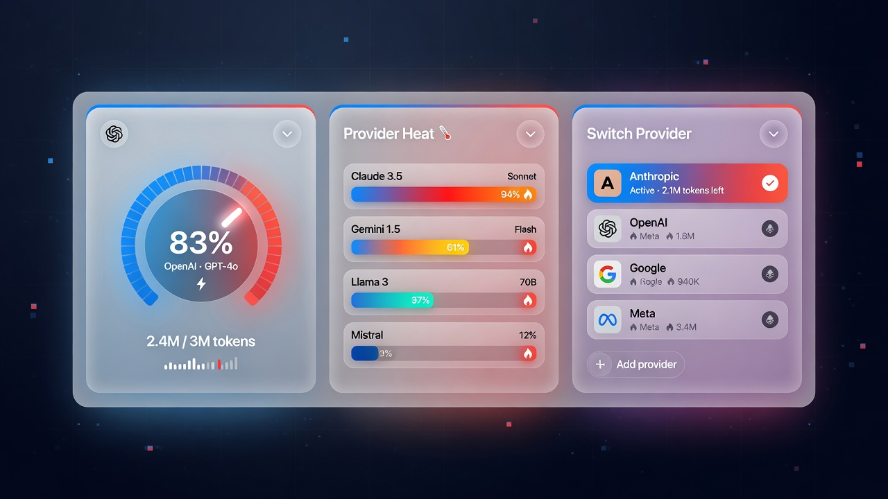
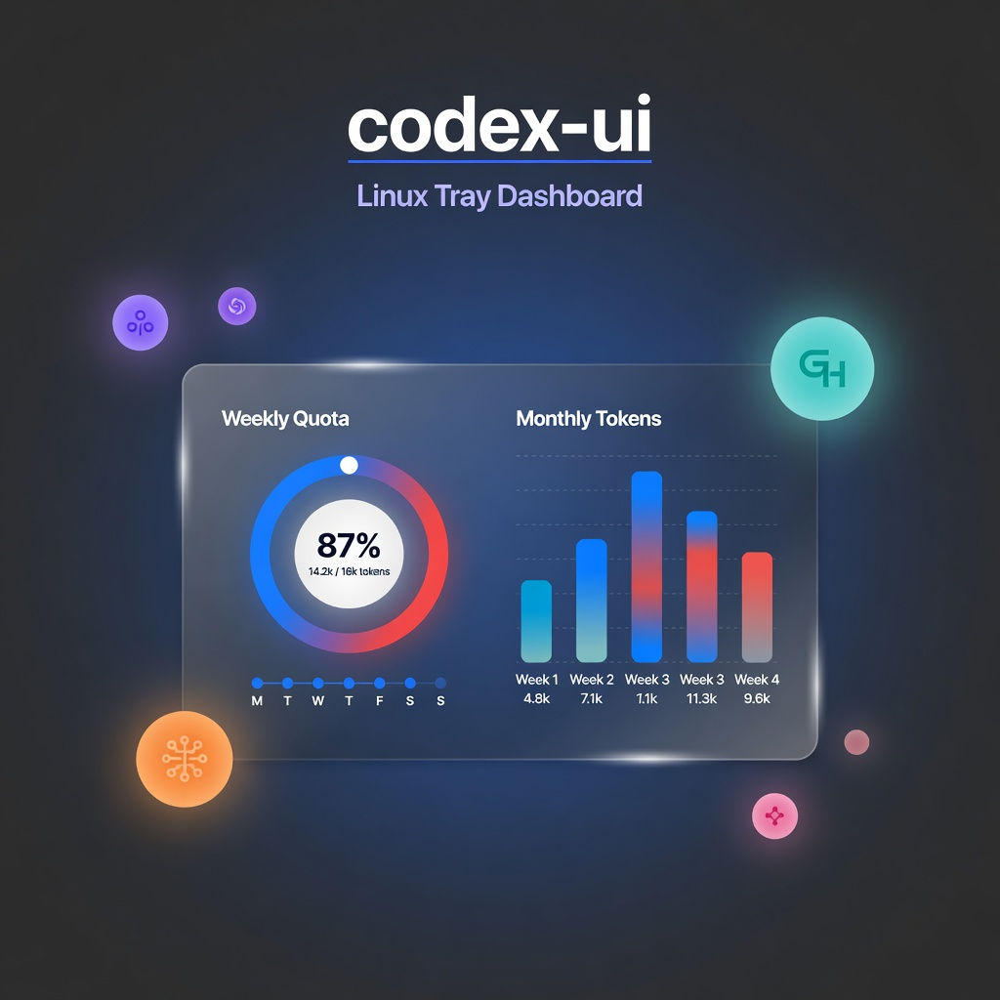

# codex-ui

<p align="center">
  
</p>

<p align="center">
  <strong>Linux 托盘里的多公司 AI 额度看板</strong><br/>
  OpenAI Codex · Claude · Grok · Mistral · 月之暗面 · 智谱
</p>

<p align="center">
  <a href="./README.md">English</a>
  ·
  <a href="#快速开始">快速开始</a>
  ·
  <a href="#功能亮点">功能亮点</a>
</p>

---

Codex 在 Windows / macOS 有官方桌面端，Linux 上往往只剩 CLI。想知道 **还剩多少额度、何时重置**，通常要翻终端或网页控制台。

**codex-ui** 是一个轻量托盘应用：不挡路、不装 Electron 全家桶。一条脚本、沿用本机已有登录态，优先展示**官方剩余额度**（在提供方暴露接口时），无需粘贴 token。

技术栈：**Neutralino + React + TypeScript**。

## 界面预览

<p align="center">
  
  &nbsp;
  
</p>

<p align="center">
  
</p>

## 功能亮点

| 模块 | 说明 |
|------|------|
| **多公司折叠选择** | OpenAI / Claude / Grok / Mistral / Kimi / GLM；**已抓到用量的公司自动置顶** |
| **OpenAI Codex** | 5 小时 / 7 天窗口（app-server 或 WHAM）、重置次数、模型用量与 API 等价估价 |
| **Grok** | 官方 `cli-chat-proxy` billing：周额度 + Build/Chat + 月 credit（**不是**上下文窗口） |
| **Mistral Vibe** | 月 Token；有 rate-limit 头则用官方，免费档无月 cap 时展示本月本地会话 |
| **热力进度条** | **蓝 → 红**连续渐变：越低越蓝，越高越红 |
| **秒开体验** | 磁盘 SWR：先画上次缓存，后台刷新；Codex / Grok / Mistral 远端并行 |
| **本机优先** | 自动读 `~/.codex`、`~/.grok`、`~/.vibe` |
| **Linux 托盘** | 设置里可开开机自启；Zorin / Wayland 保留任务栏入口 |

## 快速开始

```bash
./run.sh
```

脚本会安装依赖、准备 Neutralino、检查 Codex 登录（必要时 `codex login`）、构建并启动托盘 UI。

### 开发校验

```bash
npm test
npm run typecheck
npm run build
```

### 产物路径

```text
neutralino-dist/codex-ui/
neutralino-dist/codex-ui/bin/neutralino-linux_x64
```

## 额度如何加载

```text
打开托盘
  → 有缓存则立刻显示
  → 阶段 A：本地扫描 + 合并上次远端数字
  → 阶段 B：并行官方接口
       · Codex app-server / WHAM
       · Grok  GET /v1/billing（含 ?format=credits）
       · Mistral rate-limit 探测（约 10 分钟缓存）
```

Grok / Mistral **不会**把会话 context 窗口计数当成 API 额度消耗。

## 本机认证路径（只读）

| 公司 | 路径 |
|------|------|
| OpenAI Codex | `~/.codex/auth.json` |
| Grok / xAI | `~/.grok/auth.json`（OIDC） |
| Mistral Vibe | `~/.vibe/.env`（`MISTRAL_API_KEY`） |

界面不粘贴 token。网络请求使用临时 curl 配置文件，用后清理。

## Zorin / Wayland

窗口保留任务栏入口，托盘图标不可用时也能找回看板。

可选：

```bash
./run.sh --setup-tray
```

## 目录结构

```text
src/
  components/     # 看板 UI（公司折叠、环图、Grok/Mistral 面板）
  services/       # 用量解析、本地抓取、Neutralino 后端
  store/          # Zustand
docs/images/      # README 宣传图
```

## 隐私与对本机影响

- 额度缓存仅存本机（Neutralino storage / 小 JSON）
- 不装驱动、不改系统网络
- 开机自启仅在你于设置中开启时生效
- `docs/images/` 仅为宣传素材，不参与运行时逻辑

## 状态

个人开源项目，欢迎 Issue / PR。

---

<p align="center">
  <sub>给只想知道「AI 额度还剩多少」的 Linux 用户。</sub>
</p>
