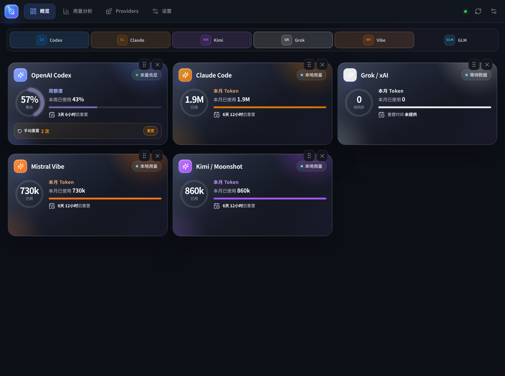
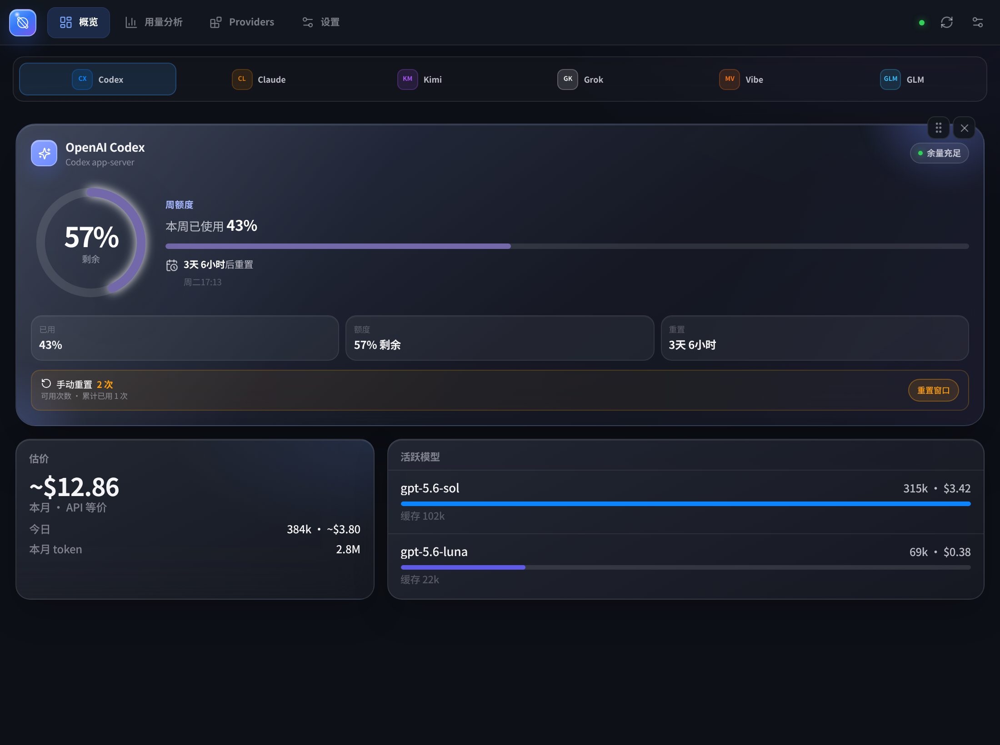
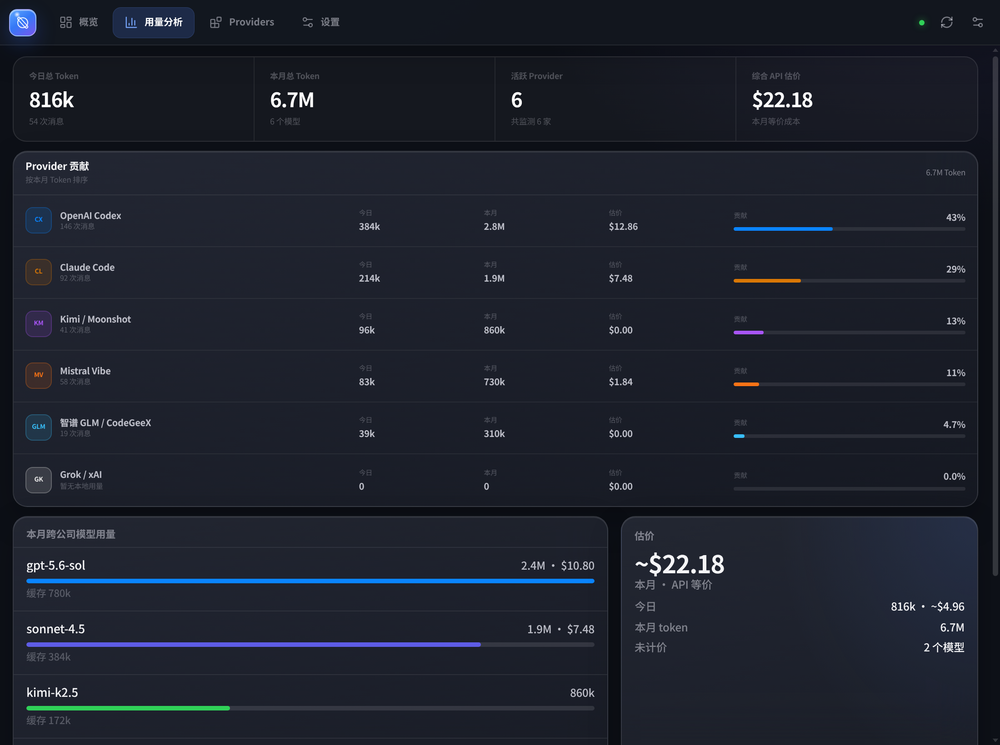
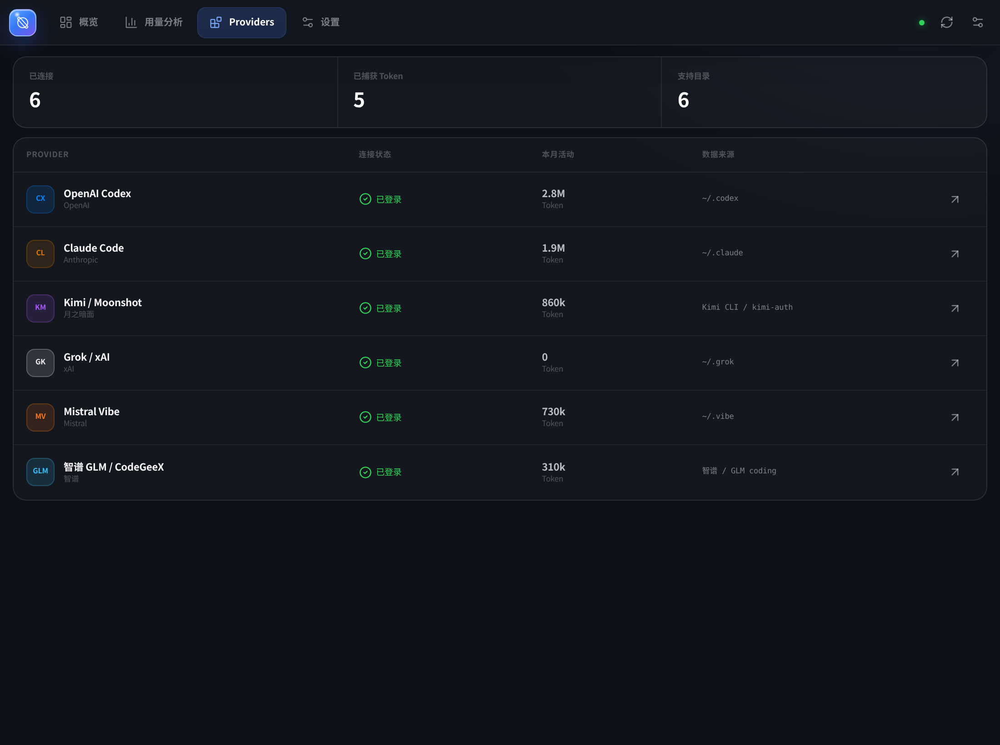

<p align="center">
  
</p>

<p align="center"><strong>在 Linux 上直接看 AI 还剩多少额度——不用翻终端，也不用切网页控制台。</strong></p>

<p align="center">
  <a href="./README.md">English</a>
  ·
  <a href="#快速开始">快速开始</a>
  ·
  <a href="#功能">功能</a>
  ·
  <a href="#额度如何加载">工作原理</a>
</p>

<p align="center">
  
  <br/>
  <sub>真实应用截图——额度卡片、连接状态与跨公司用量</sub>
</p>

---

Codex 在 Windows / macOS 有官方桌面端，Linux 上往往只剩 CLI。想知道 **还剩多少额度、何时重置**，通常得翻终端日志，或在各个厂商网页控制台之间来回切。

**codex-ui** 是一个面向 Linux 的轻量桌面控制台：从顶部组件库拖入多家 AI，优先展示官方剩余额度（在提供方暴露接口时），托盘常驻，一点就开。

技术栈：**Neutralino + React + TypeScript** —— 不塞一整颗 Electron。

## 功能

- **多公司组件库** — OpenAI Codex、Claude、Grok、Mistral Vibe、Kimi、GLM。始终展开，拖入或点击即可编排看板。
- **官方额度优先** — Codex app-server / WHAM 窗口、Grok 官方 billing、Mistral rate-limit 头（可用时）。**不会**把会话 context 窗口计数当成 API 账单。
- **跨公司用量分析** — 汇总 Token、消息、成本估价、Provider 贡献占比、跨公司模型排行。
- **秒开** — 磁盘 SWR：先画上次缓存，后台并行刷新远端。
- **本机登录态** — 自动读 `~/.codex`、`~/.grok`、`~/.vibe` 等；界面不粘贴 token。
- **Linux 托盘 + 任务栏** — 可选开机自启；Zorin / Wayland 下托盘不稳时仍可从任务栏找回窗口。

## 界面截图

<p align="center">
  
  <br/>
  <sub>概览 — Codex 周剩余、重置倒计时、模型用量</sub>
</p>

<p align="center">
  
  <br/>
  <sub>用量分析 — Token、成本估价、Provider 贡献</sub>
</p>

<p align="center">
  
  <br/>
  <sub>Providers — 登录状态与本机数据目录一览</sub>
</p>

<p align="center">
  
  <br/>
  <sub>公司组件库 — 点击或拖入即可拼看板</sub>
</p>

## 快速开始

**环境：** Linux、Node.js 20+、图形会话。建议已执行过 `codex login`（可选）。

```bash
git clone https://github.com/dell121212/codex-ui.git
cd codex-ui
./run.sh
```

脚本会安装依赖、准备 Neutralino、检查 Codex 登录（必要时 `codex login`）、构建并启动托盘 UI。

### 开发校验

```bash
npm test
npm run typecheck
npm run build
```

### 构建产物

```text
neutralino-dist/codex-ui/bin/neutralino-linux_x64
```

## 额度如何加载

```text
打开应用
  → 有缓存则立刻显示
  → 阶段 A：本地会话扫描 + 合并上次远端数字
  → 阶段 B：并行请求官方接口
       · Codex app-server / WHAM
       · Grok  GET /v1/billing（含 ?format=credits）
       · Mistral rate-limit 探测（约 10 分钟缓存）
```

Grok / Mistral **不会**把会话 context 窗口计数当成 API 额度消耗。

## 本机认证路径（只读）

| 公司 | 典型路径 |
|------|----------|
| OpenAI Codex | `~/.codex/auth.json` |
| Grok / xAI | `~/.grok/auth.json`（OIDC） |
| Mistral Vibe | `~/.vibe/.env`（`MISTRAL_API_KEY`） |
| Claude / Kimi / GLM | 对应 CLI 主目录（存在时） |

Token 不进界面。网络请求使用临时 curl 配置文件，用后清理。

## Zorin / Wayland

窗口保留任务栏入口，托盘图标不可见时也能找回看板。

可选安装托盘相关组件：

```bash
./run.sh --setup-tray
```

## 隐私

- 额度缓存仅存本机（Neutralino storage / 小 JSON）
- 不装驱动、不改系统网络
- 开机自启仅在设置中手动开启后生效

## 目录结构

```text
src/
  components/   # 工具栏、拖拽画布、工作区
  services/     # 用量解析、本机抓取、Neutralino 后端
  store/        # Zustand
docs/images/    # README 截图（真实运行界面）
```

## 状态

个人开源项目，边角可能还糙。欢迎 Issue / PR。

---

<p align="center">
  <sub>给只想知道「AI 额度还剩多少」的 Linux 用户。</sub>
</p>
